# Introducción a Proxmox

Proxmox VE es una excelente opción para empresas de hosting debido a su capacidad para gestionar múltiples máquinas virtuales y contenedores de manera eficiente. Su soporte para alta disponibilidad garantiza que los servicios críticos permanezcan operativos incluso en caso de fallos de hardware. Además, las herramientas integradas de copias de seguridad y recuperación permiten proteger los datos de los clientes de manera confiable.

La interfaz web intuitiva de Proxmox facilita la administración centralizada, lo que reduce la complejidad operativa y mejora la productividad del equipo técnico. Al ser una solución de código abierto, también permite a las empresas de hosting reducir costos de licencias y personalizar la plataforma según sus necesidades específicas, ofreciendo así un servicio más competitivo y adaptado a sus clientes.

## Resum de configuració

En aquesta configuració de Proxmox, s'ha implementat la següent infraestructura:

- **pfSense**: Configurat com a tallafocs principal per gestionar el tràfic de xarxa.
- **Cluster de Proxmox**: Tres nodes clusteritzats amb alta disponibilitat (HA).
- **Ceph Squid 19.2**: Cada node té un disc de 200 GiB connectat al servei Ceph per proporcionar emmagatzematge distribuït.
- **HA Group**: Configurat per assegurar que, en cas de fallada d'un node, les màquines virtuals i els contenidors (LXC) es migrin automàticament a un altre node del grup.
- **TrueNAS**: Configurat com a recurs compartit per centralitzar les ISOs i plantilles.

Aquesta configuració garanteix una infraestructura robusta, escalable i preparada per a fallades.

## Instal·lació de PFSense

Pots descarregar l’ISO de Pfsense [aqui](https://repo.ialab.dsu.edu/pfsense/pfSense-CE-2.7.2-RELEASE-amd64.iso.gz) (després de descarregar el fitxer, ho descomprimim, es pot fer amb 7zip o winrar).

Després de muntar l’ISO, procedirem a crear una Màquina Pfsense:

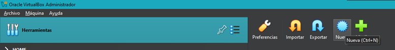

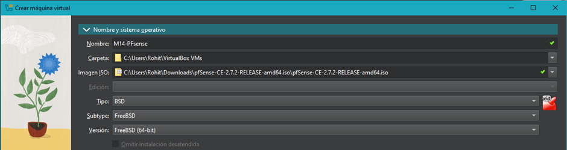

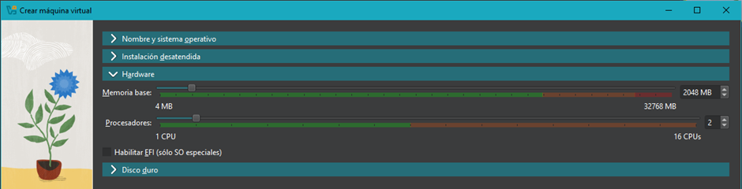

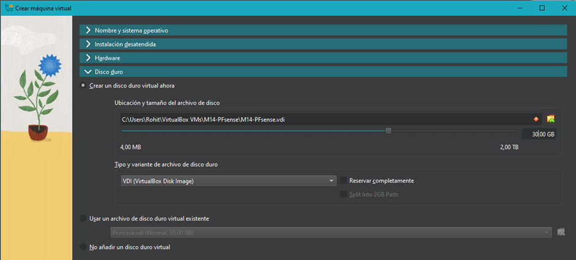

Configuració de la xarxa:

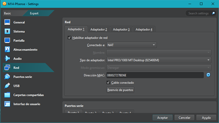

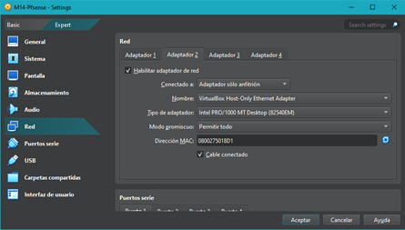

També, dins de la configuració de Xarxa(en VirtualBox) hauríem de tenir una interfício HostOnly, recordeu de desactivar el DHCP Server , ja que Pfsense s’encarregarà d’ell.

Iniciem la màquina Pfsense:

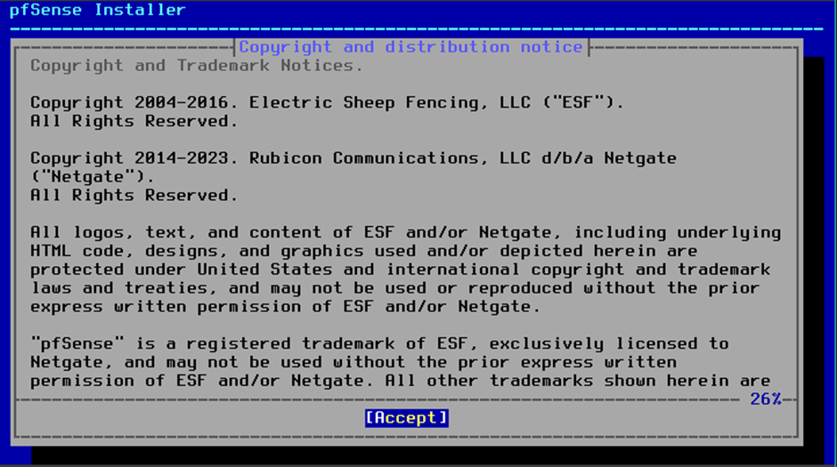

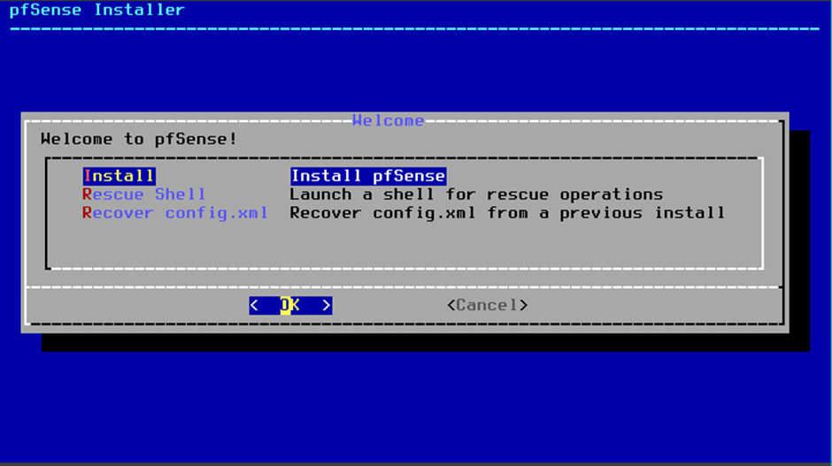

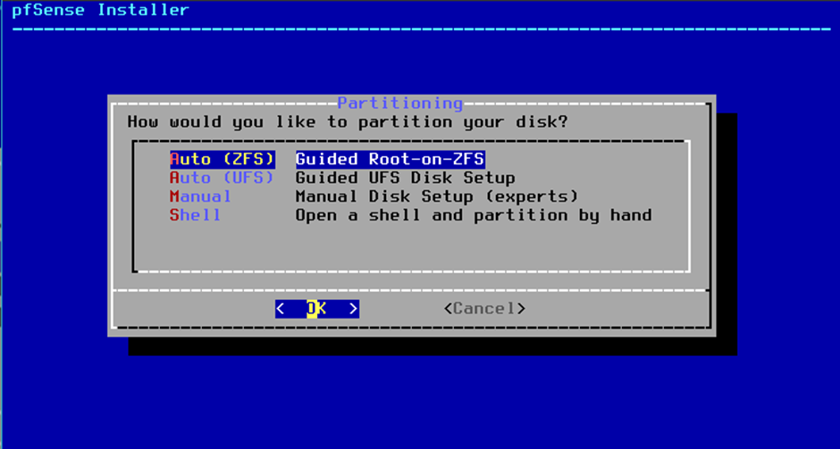

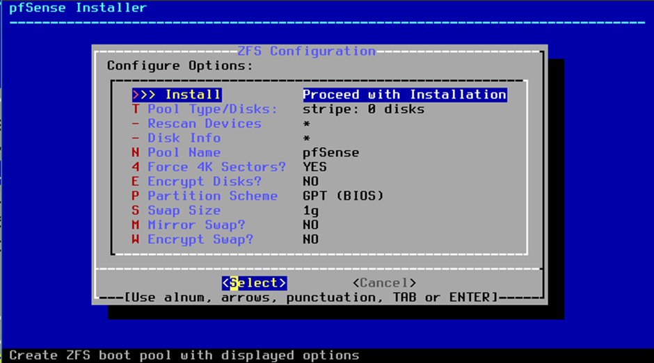

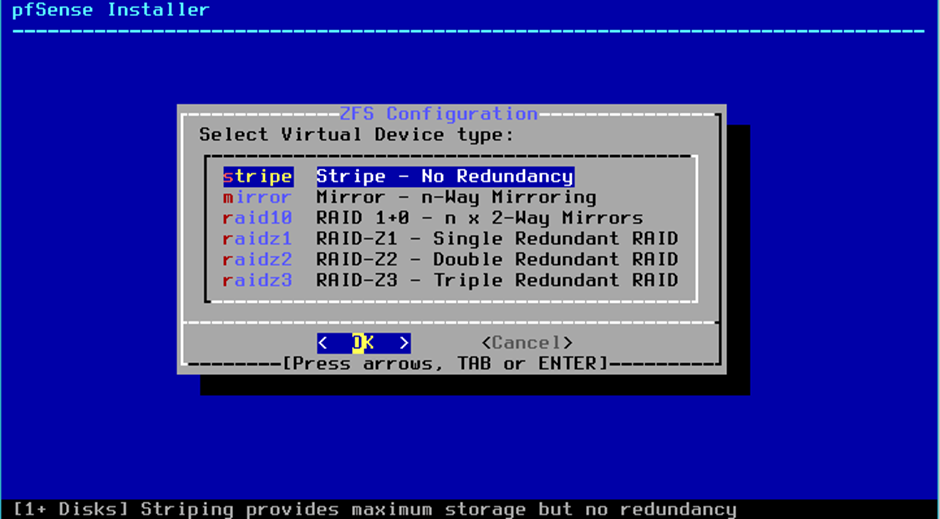

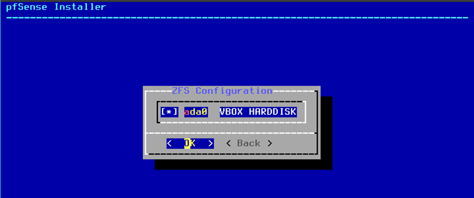

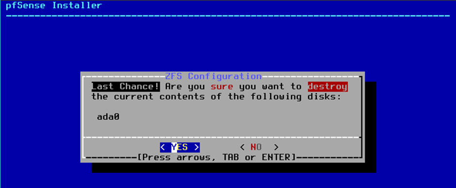

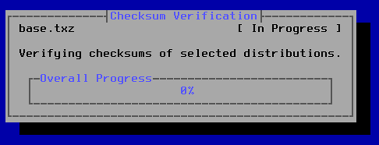

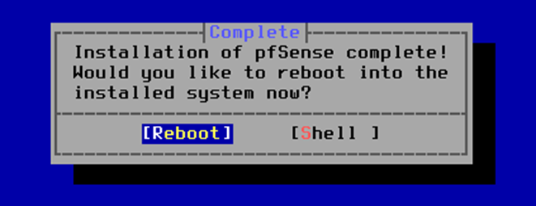

Una vegada reinicat, caldrà desmuntar el disc ISO de la màquina. Després reiniciem la màquina i esperem que fagi la seva màgia:

Hauria de surtir una pantalla exactament com aquesta:

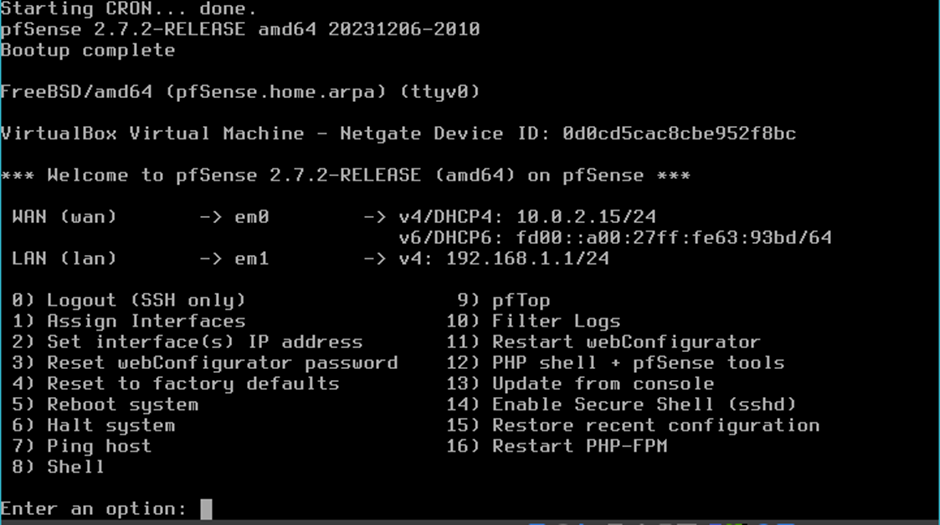

La WAN s’agafa automàticament via DHCP, però la LAN no, per defecte ho deixa 192.168.1.1, en el nostre cas hem de fer de forma MANUAL:

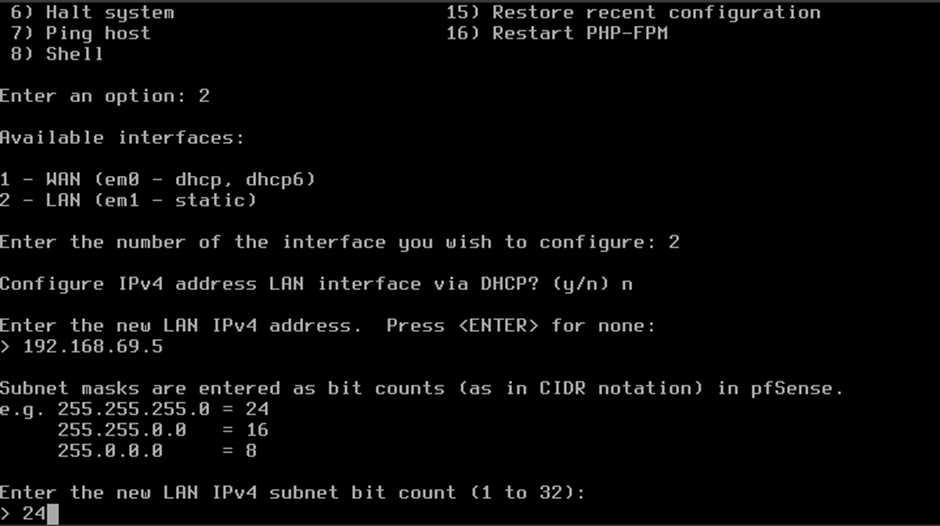

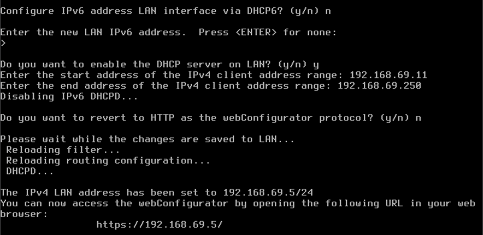

Ara ens tocarà accedir des d’un navegador web a aquesta ip: (User: admin ; pass: pfsense)

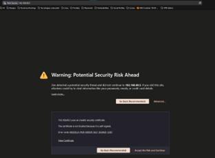

Una vegada entrat, al entorn gràfic fem Next a cada pàgina ja que són opcions per defecte que no ens interessen, també demanrà conaviar la contrasenya per defecte de pfsense, ho heu de fer per seguretat.

Les principals configuracions que hem de fer és configurar el DHCP:

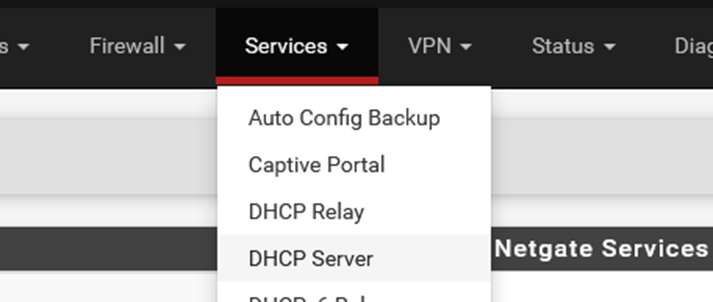

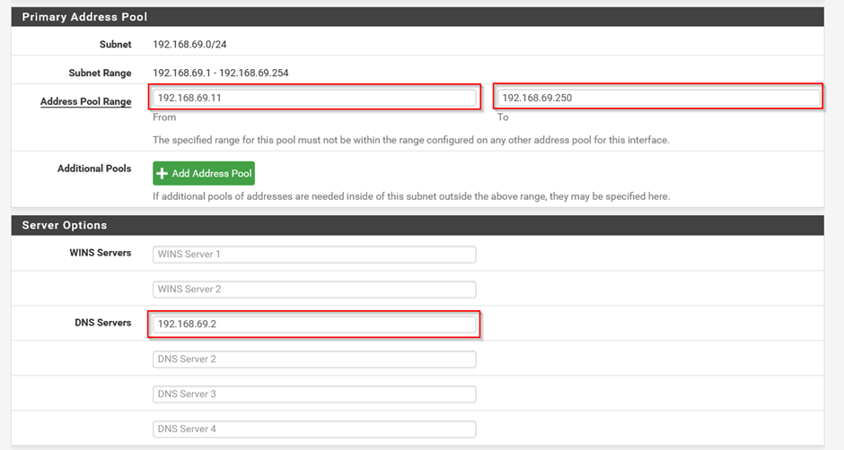

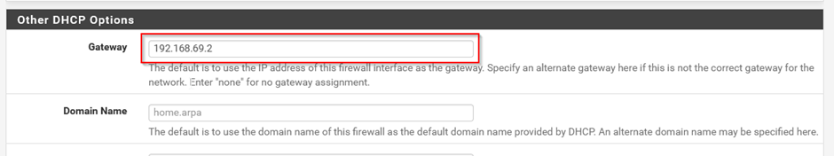

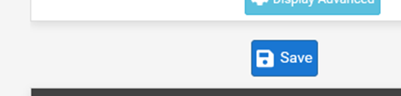

També hem fet MAC Filetring ja que els servidors sempre han de tenir IP Estàtica:

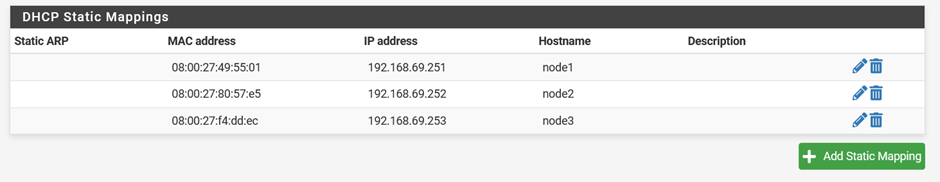

Després de muntar el pfsense, ens faltarà la instal·lació i configuració de Proxmox.

## Instal·lació i configuració de Proxmox

El primer que haurem de fer es crear la màquina virtual i configurar-la correctament. Començarem seleccionat el tipus (un Debian) i li assignarem 8GB de RAM.

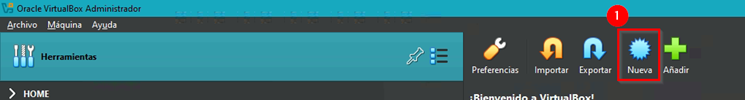

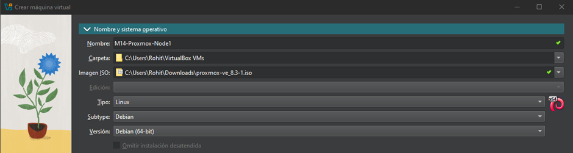

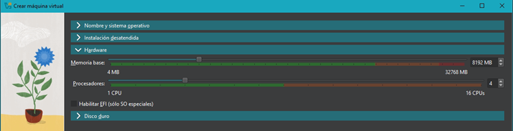

Seguidament determinarem l’espai del disc dur, en aquest cas hem decidit assignar-li un disc de 200GB

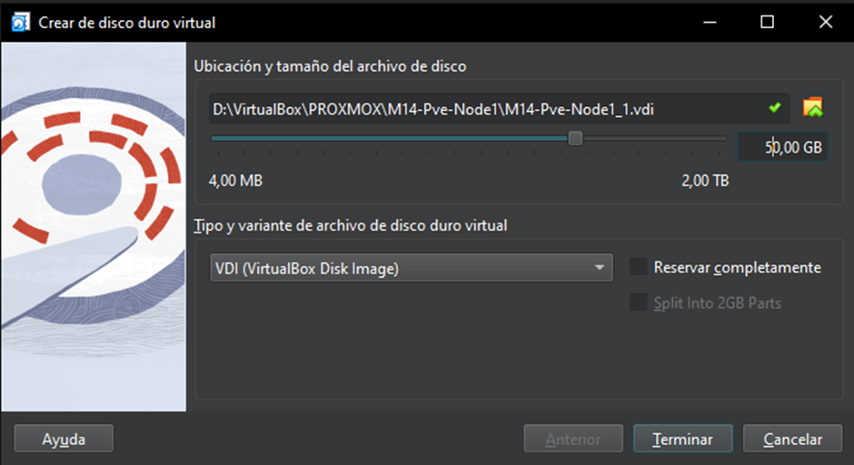

Fem clic dret esquerre a Terminar i ens hauria de mostrar la màquina virtual:

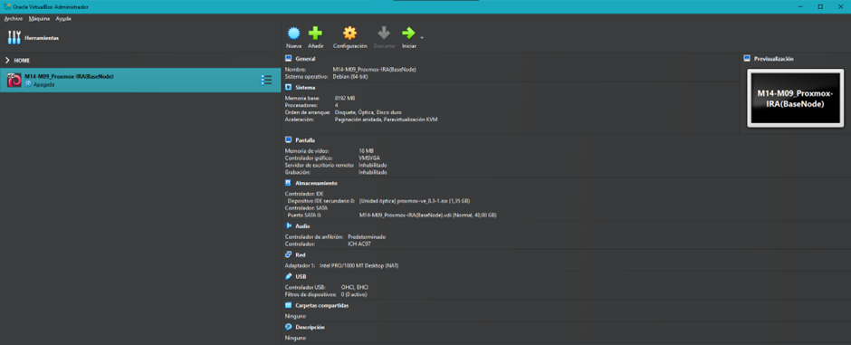

(Fins aquest punt ja tenim la Màquina virtual creada.Pero falten algunes configuracions imporants...)

A continuació li posarem la ISO de Proxmox a la interfície SATA. Per defcte vé en IDE, recomanem connectar a SATA tant els discos com els medis d’instal·lació.

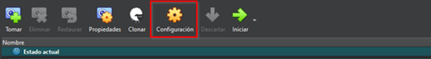

Per defecte  és així:
